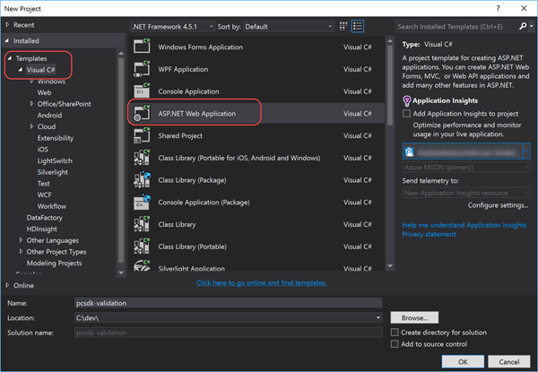
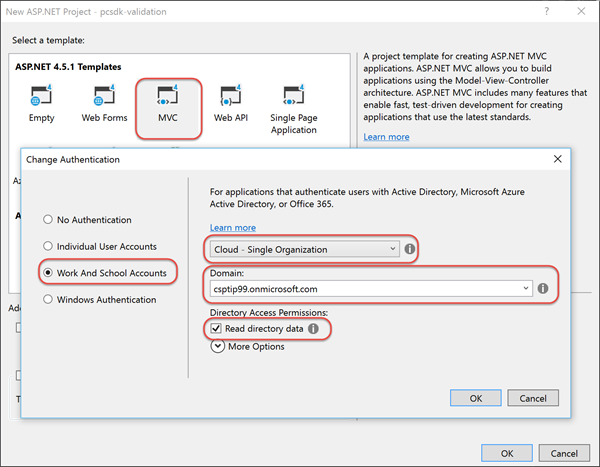
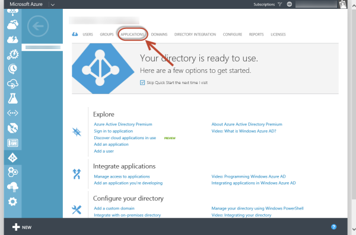

# Avoiding Common Order Submission Issues

CSP partners commonly run into issues when placing orders due to validation checks that occur in the commerce system. Many of these issues can be addressed prior to submitting an order by the partner. In this lab you will learn about some of these techniques.


## Prerequisites

*Refer to the [Hands-On Lab Prerequisites](../hol-prereqs.md) for a full list of all prerequisites, additional details and additional resources.*

- Have access to the [Partner Center](https://partnercenter.microsoft.com) website & your partner ID.
- Have the login information for your CSP Integration Sandbox account.
- Developer environment with Visual Studio 2015 installed & configured.


## Exercise 1: Create ASP.NET MVC Application To List Customers

In this exercise you will create a new ASP.NET MVC application that will list all of the customers in your CSP partner / Integration Sandbox account.

### Create Visual Studio Project & Onboard Azure AD Application

Before coding up the project, you first need to create a new project that will also register an Azure AD application that your application will use to talk to the Partner Center SDK. Once it's created you then need to onboard the application in Partner Center dashboard.

1. Launch **Visual Studio 2015**.
1. Create a new ASP.NET MVC project:
  1. Select **File** :arrow_right: **New** :arrow_right: **Project**
  1. In the **New Project** dialog, from the **Visual C#** templates, select **ASP.NET Web Application**.
  1. Name the project **pcsdk-order**.

    > Feel free to name the project anything, but keep in mind the namespace references in the code snippets in the remainder of the lab may not match... just ensure you use the correct namespace for your project.

    

  1. In the **New ASP.NET Project** dialog:
    1. Select the template **MVC**
    1. Click the **Change Authentication** button and select **Word and School Accounts**.
    1. Set the authentication type to **Cloud - Single Organization**.
    1. Set the **Domain** to the domain of your CSP / Integration Sandbox account. *This is the domain of your CSP Azure AD tenant that Visual Studio will register an Azure AD application in when it creates the project.*

      > For instance, if your CSP account login is `admin@csptip99.onmicrosoft.com`, enter the domain `csptip99.onmicrosoft.com`.
    
    1. Check the box **Read directory data**.
    1. Click **OK** to accept the settings in the dialogs to save your changes.

    

      > Visual Studio may prompt you to login to your Azure AD tenant when you click **OK**. This is because Visual Studio must login to the Azure AD tenant to register the Azure AD application for you.

  Once the Visual Studio project has been created & the Azure AD application registered, the next step is to make sure the Azure AD application has the necessary permissions to talk to the Parter Center SDK. This process is referred to as *onboarding the application with Partner Center*.

  Partner Center will require you know the name of the application to onboard it but because you didn't enter a name, this can be challenging. Therefore you need to determine the name of the application in Azure AD that Visual Studio registered for you. For this use the Azure Management Portal.

1. Navigate to the **Azure Management Portal**: https://manage.windowsazure.com.
  1. Enter the credentials for your Azure Subscription that has access to manage your Integration Sandbox's AAD directory.

    > If you have not associated your Integration Sandbox AAD directory with an Azure subscription or this is not familiar, refer to this document: [Associating CSP Integration Sandbox Azure AD directory with Azure Subscription](../asscociate-aad-dir-azure-sub.md).

  1. In the left-hand navigation, scroll down and select the **Active Directory** menu item.
  1. Click on the name of the directory for your CSP Integration Sandbox.
  1. Click on the **Applications** menu item at the top of the page:

    

  1. Locate the application:
    1. Switch the **Show** toggle to **Applications my company owns**.
    1. In the **Search** box, enter the ID (GUID) of the Azure AD application Visual Studio registered. You will find this in the `web.config` file of the Visual Studio project under the `<appSetting>` named **ida:ClientId**.
    1. There should only be one app in the search results. Select it and verify the **Client ID** matches up with the ID in your ASP.NET project's `web.config`. Make a note of the name of this application.
1. Navigate to the Partner Center dashboard, **https://partnercenter.microsoft.com**, and login using your Partner account’s credentials.
1. In the left-hand navigation, select **Account Settings**.
1. In the left-hand navigation, select **API**.
1. On the API page, select the application that you found in the Azure Management Portal from the list of available options in the selector and click the **Register App** button.

  > Note: If an application is already registered, you will need to first click the **unregister** link in the top-right corner. This will then allow you to onboard your new Azure AD application.

Now verify you can login to the ASP.NET MVC web application you created.

1. Ensure the ASP.NET MVC web application project you created previously in this lab.
1. Update the ASP.NET application to load the OWIN stack to handle the authentication pipeline:
  1. Open the file `Startup.cs`.
  1. You need to tell the runtime to load this file when the application starts up. Add the following line just before the `namespace` declaration to add an assembly directive that will tell OWIN, on startup, to load this object which will call the `Configure()` method that calls the `ConfigureAuth()` method:

    ```c#
    [assembly: OwinStartup(typeof(pcsdk-order.Startup))]
    ```

1. Test the application by pressing **[F5]**. 
  1. You should be taken to Azure AD & prompted to login. Use your CSP login credentials
  1. Upon a successful login, Azure AD will redirect you back to your ASP.NET MVC application's homepage. Notice in the top-right corner your login name is displayed.

At this point you have created the core ASP.NET MVC application, registered an Azure AD application, onboarded the Azure AD application with Partner Center and setup the ASP.NET MVC application to login to Azure AD.

### List All CSP Customers

In this exercise you will extend the ASP.NET MVC application to list all the customers in your CSP account using the Partner Center SDK.

1. Your ASP.NET MVC application is going to leverage the view model and repository patterns. The first step is to create a few entities.
  1. Within the `Models` folder, create a new file `MyCustomer.cs`.
  1. Ensure this file has the following two references in it:
  
    ```c#
    using System.ComponentModel;
    using System.ComponentModel.DataAnnotations;
    ```

  1. Add three classes to this file: `MyCustomer`, `MyBillingProfile` and `MyAddress`. You will find the code for all three classes in the [snippets](snippets) folder within this lab that you can copy-paste into the `MyCustomer.cs` file.
  
    Notice that each of these classes has properties that have been decorated with data annotations that the ASP.NET MVC engine will enforce when making edits.
    
The project will then need a customer repository that will do the work of interacting with the Partner Center SDK and translating Partner Center objects to and from our internal entity classes. But first we need to create two utility classes.

1. Add a settings helper to the project:
  1. Add a new folder, `Utilities`, to the root of the project.
  1. Add a new file, `SettingsHelper.cs` to the folder `Utilities`.
  1. Add the following reference to pull values from the `web.config`:

    ```c#
    using System.Configuration;
    ```

  1. Use the code in the [snippets/SettingsHelper.txt](snippets/SettingsHelper.txt) code snippet to implement this class. Looking through the class, notice it pulls values out of the `web.config` and also combines a few useful ones.

1. Create an authentication helper to obtain the necessary Partner Center authentication token:
Before you start coding, add some NuGet package dependencies that you will need in the project.

  1. Within the **Solution Explorer** tool pane, right-click the project and select **Manage NuGet Packages...**.
  1. Find and install the following package:
    - Microsoft.Store.PartnerCenter *v1.**
  1. Add a new file `PcAuthHelper.cs` to the `Utilites` folder.
  1. Add the following references to the top of the file:

    ```c#
    using Microsoft.IdentityModel.Clients.ActiveDirectory;
    using Microsoft.Store.PartnerCenter;
    using Microsoft.Store.PartnerCenter.Extensions;
    using System.Security.Claims;
    using System.Threading.Tasks;
    using pcsdk-order.Models;
    ```

  1. Add the following single static method to the `PcAuthHelper.cs` file. This method will authenticate with Azure AD using the ADAL library and then use the token it obtains to obtain a Partner Center token. It then creates an instance of the `IPartner` Partner Center object and returns it to the caller. This way, our repository doesn't have to deal with any authentication logic.

    ```c#
    public static async Task<IAggregatePartner> GetPartnerCenterOps() {
      var signInUserId = ClaimsPrincipal.Current.FindFirst(ClaimTypes.NameIdentifier).Value;
      var userObjectId = new UserIdentifier(ClaimsPrincipal.Current.FindFirst(SettingsHelper.ClaimTypeObjectIdentifier).Value,
                                            UserIdentifierType.UniqueId);
      var clientCred = new ClientCredential(SettingsHelper.ClientId, SettingsHelper.ClientKey);

      // create auth context & login to AAD
      AuthenticationContext authContext = new AuthenticationContext(SettingsHelper.AadTenantAuthority, new ADALTokenCache(signInUserId));
      var adAuthResult = await authContext.AcquireTokenSilentAsync(SettingsHelper.PartnerCenterApiResourceId, clientCred, userObjectId);

      // login to partner center
      var adAuthToken = new AuthenticationToken(adAuthResult.AccessToken, adAuthResult.ExpiresOn);
      var pcCreds = await PartnerCredentials.Instance.GenerateByUserCredentialsAsync(SettingsHelper.ClientId, adAuthToken);
      var partnerOps = PartnerService.Instance.CreatePartnerOperations(pcCreds);

      return partnerOps;
    }
    ```

1. Now create a repository that will be used to work with customers.
  1. Add a new file `MyCustomerRepository.cs` to the `Models` folder.
  1. Add the following references to the file:

    ```c#
    using Microsoft.Store.PartnerCenter.Models;
    using Microsoft.Store.PartnerCenter.Models.Customers;
    using System.Threading.Tasks;
    using pcsdk_order.Utilities;
    ```

  1. First add a method that will be used to get a list of customers from Partner Center:

    ```c#
    public static async Task<List<MyCustomer>> GetCustomers() {
      var partner = await PcAuthHelper.GetPartnerCenterOps();

      // get list of customers from PC
      var pcCustomers = partner.Customers.Get();
      // convert customers to local model
      var customers = new List<MyCustomer>();
      foreach (var pcCustomer in pcCustomers.Items) {
        var customer = ConvertCustomer(pcCustomer);
        customers.Add(customer);
      }

      return customers.ToList();
    }
    ```

  1. Then add a method that will get a single customer from Partner Center:

    ```c#
    public static async Task<MyCustomer> GetCustomer(string customerId) {
      var partner = await PcAuthHelper.GetPartnerCenterOps();

      // get customer from PC & convert to local model
      var pcCustomer = await partner.Customers.ById(customerId).GetAsync();
      var customer = ConvertCustomer(pcCustomer);

      return customer;
    }
    ```

  1. Next, add two versions of the same method that will convert Partner Center customers to our internal project's customer entity and back. To save typing you will find these methods, `ConvertCustomer()`, in the [snippets/ConvertCustomer.txt](snippets/ConvertCustomer.txt) file.

1. The last step before creating the controller and view is to create the view model that will be used to pass data back and forth between the two.
  1. Add a new file, `CustomerViewModel.cs` to the `Models` folder.
  1. Add the following references to the top of the file:

    ```c#
    using System.Web.Mvc;
    ```

  1. Add the following public properties and constructors to the view model class:

    ```c#
    public List<MyCustomer> Customers { get; set; }

    public MyCustomer Customer { get; set; }

    public IEnumerable<SelectListItem> Countries { get; set; }

    public IEnumerable<string> ValidationErrors { get; set; }
    public CustomerViewModel() {
      ValidationErrors = new List<string>();
    }

    public CustomerViewModel(MyCustomer customer) {
      Customer = customer;
      ValidationErrors = new List<string>();
    }
    ```

At this point the plumbing has been setup for you to now add a controller and view to list all customers on the site.

1. Add a new `CustomersController` controller:
  1. Right-click the **Controllers** folder and selecting **Add &raquo; Controller**.
  1. Select the scaffold option **MVC 5 Controller with read/write actions** and click **Add**.
  1. When prompted for a controller name, enter **CustomerController** and click **Add**.
  1. Add the following references to the top of the file:

    ```c#
    using System.Threading.Tasks;
    using pcsdk_order.Models;
    ```

1. Populate the `Index` action for the customer controller.
  1. Update the `Index` action to be async and to only accept calls by authenticated users by decorating it with the `[Authorize]` attribute.

    ```c#
    [Authorize]
    public async Task<ActionResult> Index() {
    }
    ```

  1. Then add the following lines that retrieve all the customers from your CSP account and returns them to the view using the view model:

    ```c#
    CustomerViewModel viewModel = new CustomerViewModel();
    viewModel.Customers = await MyCustomerRepository.GetCustomers();
    return View(viewModel);
    ```

1. Now add the view for the customer list.
  1. Within the `Index` action method, right-click and select **Add View**.
    1. Leave the **View name** as **Index**.
    1. Set the **Template** to **List**.
    1. Set the **Model class** to **CustomerViewModel**.
    1. Click **Add**.
  1. When the `Index.cshtml` file loads...
    1. Change the model on the first line to:

      ```razor
      @model pcsdk_order.Models.CustomerViewModel
      ```

    1. Remove the `@Html.ActionLink("Create new", "Create")` line.
    1. Remove the `@Html.ActionLink("Details","Details", ...` line.
    1. Remove the `@Html.ActionLink("Edit","Edit", ...` line.
    1. Remove the `@Html.ActionLink("Delete","Delete", ...` line.
    1. Update the table header to list the following columns:

      ```html
      <tr>
        <th>Tenant ID</th>
        <th>Company Name</th>
        <th>Domain</th>
        <th></th>
      </tr>
      ```

    1. Update the `@foreach` statement to show a list of customers and write out the fields for each customer:

      ```razor
      @foreach (var item in Model.Customers) {
        <tr>
          <td>@Html.DisplayFor(modelItem => item.TenantId)</td>
          <td>@Html.DisplayFor(modelItem => item.CompanyName)</td>
          <td>@Html.DisplayFor(modelItem => item.Domain)</td>
          <td>@Html.ActionLink("Subscriptions", "Subscriptions", new { id = item.Id })</td>
      ```

1. Finally add a navigation element to our Customers list. 
  1. Open the file `Views/Shared/_Layout.cshtml`.
  1. Locate the section with the navigation elements *Home*, *About*, and *Contact* and add the following link:

    ```razor
    <li>@Html.ActionLink("Customers", "Index", "Customer")</li>
    ```

1. Now test the application by pressing **F5**. You will be prompted to authenticate and then you should be presented with a list of all the customers in your CSP account.


## Exercise 2: Addressing Limit Exceeded Errors

In this exercise you will take the .NET application you configured in the previous exercise in this hands-on-lab and update handle a common issue customers run into: identify and address the scenario when a customer tries to purchase licenses that exceed the max licenses allowed.

## Exercise 3: Transitioning an Office 365 Subscription

In the case of the previous scenario, one option is for a customer to upgrade an existing license from one to another to address he limit exceeded error. In this exercise you will take the .NET application you configured in the previous exercise to handle this scenario.
